# Villager Race
This program runs a race with all of the players you enter into the players.txt file. Instead of turtles, each player is a villager from Animal Crossing: New Horizons. It's a fun spin on traditional randomization, based on the [Turnip Turtle](https://github.com/gioperalto/turnip-turtles) project. All of the villagers race toward the target, but there's no telling where they will go!

## Gameplay

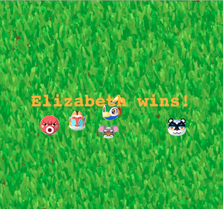

## Instructions (how to run the program) from a Terminal/Python client:
1. Have Python (and pip) installed (I use Python 3.x)
2. Install the dependencies:
    - `pip install numpy`                           (for Math stuff)
    - `pip install sys`                             (for command line arguments)
    - `pip install getopt`                          (for command line arguments)
    - `pip install os`                              (for reading villagers/backgrounds in dynamically)
3. Usage: 
    - `python race.py`                       (creates program with default target and background)
    - `python race.py -t turnip`             (creates program with turnip target)
    - `python race.py --target=bells`        (creates program with Bells image)

## To change the players:
- There is a `players.txt` file where you can change out the names
- The names in players.txt are newline seperated

## Comes with 24 ACNH villagers:
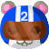  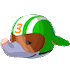 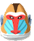 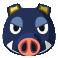 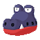 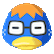 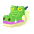 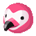 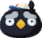 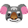 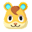 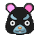 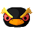 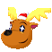 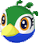 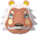 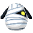 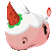 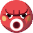 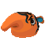 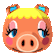 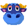 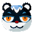
